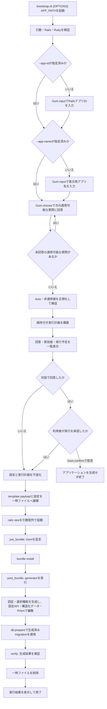

# テンプレート処理フロー

Rapid Rails Templateは、単一の`bootstrap.rb`で前段の対話とApplication Templateの適用を連携します。すべての回答と実行内容を確定してから`rails new`を起動するため、Rails標準ファイルの生成前に`--skip-*`を含むgenerator optionを確定できます。

## 変更開始境界

引数・環境検証、質問、回答の正規化、実行計画の構築と表示は、アプリケーションも一時ファイルも生成しないフェーズです。最終確認で中止した場合、`rails new`、`gem`、generator、Railsコマンド、ファイル編集は実行しません。

Application Templateだけでは、確認時点ですでにRails標準のアプリケーションファイルが存在します。本プロジェクトはその制約を後処理で補わず、`bootstrap.rb`へ対話と確認を置きます。

## フェーズ

### 環境検証

Railsが`>= 8.1, < 8.2`、Rubyが`>= 4.0, < 4.1`であることを確認します。対象外の場合は質問や変更を開始せず終了します。

### 質問と計画

`--app-id`が未指定の場合は、`APP_PATH`のbasenameを初期値として`Gum.input`でRailsアプリIDを質問します。続いて`--app-name`が未指定の場合は、確定済みのRailsアプリIDを初期値として表示用アプリ名を質問します。CLI引数で指定された個別設定を事前回答とし、依存順に未指定の適用可能な質問だけを`Gum.choose`で行います。単一選択では仕様上の既定値、`profile_features`では全featureを選択済みとして表示し、`no_limit: true`の複数選択を使用します。選択なしと`--profile-features=`はProfile生成を無効にする明示回答です。RailsアプリID、表示用アプリ名を含むすべての適用可能な項目がCLI引数で確定している場合は、対話と最終承認を省略します。回答は後続質問の表示条件にだけ使用し、質問中はGum実行可能ファイル以外の外部command、Gem追加、generator、file actionを実行しません。依存条件を満たさない質問は、仕様で定めた明示値へ正規化します。

全質問が完了してから、回答の検証、`Auto`値の解決、generator optionとstepの構築を行います。Job OperationsとMaintenance TasksはWeb PushによってSolid Queueが必須になった場合、またはSolid Queueが選択済みの場合だけ質問し、それ以外では`disable`へ正規化します。明示`enable`とSolid Queueなしの矛盾はこの段階で拒否します。画像配信方式は常に質問し、既定のRails representation routeまたは外部imgproxy serviceを実行前に確定します。確認画面には質問時の回答だけでなく、正規化後の実効値、解決理由、Gem、generator option、step、生成物、production process、production要件を一覧で提示します。

利用者が`Gum.confirm`で承認した時点で設定と実行計画を不変化します。確認の既定値は拒否とします。承認後に質問を追加したり、回答を再解釈したり、実行計画を暗黙に変更したりしません。

### Railsアプリケーション生成

RailsアプリID、表示用アプリ名、固定構成、回答からgenerator optionとApplication Identityを構築します。Application Template payloadと正規化済み設定を権限制限された一時ファイルへ展開し、設定パスを`RAPID_RAILS_TEMPLATE_CONFIG`環境変数、RailsアプリIDをRails標準の`--name`、template pathを`--template`として`rails new`を起動します。表示用アプリ名はRails generatorへ渡さず、Application Templateが生成アプリのidentity設定へ保存します。SQLite、Importmap、Tailwind CSSなどの初期構成と、メール、RuboCop、Solid系機能、デプロイ方法のskip optionはこの時点で確定済みです。Action Textは固定構成のためskip optionを持ちません。

`rails new`はshell文字列として実行せず、実行ファイルと各optionを分離した引数配列で起動します。Application Templateは回答を再質問しません。

### `pre_bundle`

Rails Application Templateの`gem`などを利用して、bundle installに必要な依存関係を宣言します。このフェーズより前にGemfileを変更しません。Action Textのeditorとして`lexxy ~> 0.9.21`を固定で宣言します。

`screen_name`または`display_name`が選択されている場合は`haikunator`を宣言し、Profile modelのUser作成時の既定値生成に使用します。どちらも選択されていない場合はGemfileへ追加しません。`avatar`が選択されている場合だけ`boring_avatars ~> 0.1.0`をRails binding付きで宣言し、画像未設定時のSVG生成に使用します。`image_delivery=imgproxy`の場合だけ`imgproxy-rails ~> 0.3.0`を宣言し、Rails配信では追加しません。Rails標準Gemfileの`image_processing`を両方式で利用します。

### `post_bundle`

最初にAction Textの公式install generatorを実行し、Active StorageとAction Textのmigrationを常設します。直後に`active_storage_db`の公式migration taskを実行し、生成されたファイル本体用migrationを`db/storage_migrate`へ移します。migration内容をApplication Templateへ複製しません。これらの処理はdaisyUI用`package.json`の生成前に行い、Importmap構成を維持します。続けてLexxyとActive StorageをImportmapへ登録し、LexxyのJavaScript、stylesheet、描画用`.lexxy-content` partialを設定します。

AnnotateRbの公式install generatorで設定とmigration hookを生成します。認証生成より前にApplication Identity、ja/en locale、request locale境界、routes/mailer URL設定を生成します。続けてActive Storage variant processorを`:vips`へ固定し、選択済みの場合だけimgproxy initializer、設定object、Active Storage専用source adapter、開発用起動command、画像配信文書を生成します。認証Userを生成した直後にAction Policyのinstall generator、`UserRole`、policy、管理画面、初期admin付与task、local seed読込口を生成し、Deviseの`current_user`またはWallet SIWEの`Current.user`を共通のauthorization contextへ接続します。認証、role、固定ページ、FAQ、footer設定、選択済みProfile feature、API、PWA、Web Push、Solid系generatorを適用します。Solid Queue導入後、Job Operations有効時はMission Control Jobsを`/admin/jobs`へmountし、公式base controller extension pointとRails Engine View overrideで既存admin認証・Action Policy・layoutへ統合します。続いてMaintenance Tasks有効時は公式install generatorを実行し、generatorが追加したroot mountをPrismで一意に検証して`/admin/maintenance_tasks`へ構造編集し、標準Run migrationを維持します。Bulma classを含むengine Viewと表示helperは2.17.0向けのhost overrideへ置き換え、外部stylesheetを追加せず既存daisyUI admin layoutへ統合します。その後、development、test、productionをprimaryとstorageに分けるdatabase設定、全環境の`:db` service、Active Storage DB initializerとengine routeを確定してから`bin/rails db:prepare`を実行します。Solid Queueの標準`config/recurring.yml`は完了ジョブを1日保持して毎時12分に公式APIで整理し、失敗ジョブをretry/discardまで保持します。PWAとWeb Pushはdefault Viewより先に設定し、layoutと両認証方式のaccount設定画面が有効なrouteと共通partialだけを参照する順序を保ちます。続けて`bin/annotaterb`を生成し、`bin/annotaterb models`でmodel、fixture、test、factory、serializerの初期annotationを確定します。`avatar`選択時は40×40と64×64のnamed variant、静止画upload policy、User IDをseedにする共通avatar helper、設定済み画像の削除routeを生成します。seed保存用migrationは作成しません。生成直後のdevelopmentとtestにpending migrationを残しません。

依存関係のインストール後、gemが提供するgenerator、Railsのgenerator、`rails_command`、設定APIを実行します。daisyUIはこのフェーズでnpm packageとして導入し、Tailwind CSS 4のinput stylesheetへcustom themeを登録します。続けてRails 8.1.3の標準templateを基準とするscaffold 6 Viewとcontroller Viewの上書きtemplateを`lib/templates/erb`へ配置し、以後の`bin/rails generate scaffold`と`bin/rails generate controller`がdaisyUI componentを使用するようにします。認証方式に応じたViewを展開した後、daisyUIのcomponent、part、modifierを優先してapplication・authentication・account・admin layout、標準ページ、固定ページ、FAQ、footer、各管理画面を生成し、Tailwind CSSをbuildします。accountとadmin layoutは共通のresponsive 2ペイン寸法を使用しますが、account左ペインと非admin時のheader dropdownにはaccount項目だけ、admin左ペインとadmin時のheader dropdownには見出し「管理画面」と管理項目だけを配置し、2種類のmenuを結合しません。Tailwind CSS utilityはresponsive layoutとDESIGN固有の調整に限定し、component itemの高さやpaddingを個別utilityで上書きしません。構造化APIで表現できないRubyコード編集にはPrismを使用します。

### `verify`

generatorの成果物、必要な設定、コマンドの終了状態を検証します。生成アプリケーションの通常テストには`bin/annotaterb models --frozen`を実行するtestを含め、annotation不足をファイル変更なしで失敗として検出します。既存の`bin/rails test`、`bin/ci`、GitHub Actionsは同じtestを実行します。検証失敗を成功として扱うフォールバックは設けず、失敗した処理と理由を表示します。

通常のアプリ生成ではブラウザを起動しませんが、test用の`evidence:capture` Rake taskと撮影runnerを生成します。リポジトリの`rake evidence:update`はWeb Pushを有効にしたDevise/Wallet SIWEとja/enのRails配信4組合せを固定optionで順番に生成し、各生成アプリのtestとRuboCopを通してから、互換versionのPlaywright CLIとChromiumを使って一時ディレクトリへ撮影します。avatarは未添付、実画像設定済み、削除後をdesktopとmobileで撮影します。さらに代表的なimgproxy構成では固定versionの実serviceを別processとして起動し、署名済みvariant URL経由の画面を撮影します。Notification、Service Worker、PushManagerは外部Push serviceへ接続しない決定的なbrowser stubを使用します。全組合せの撮影、manifest生成、整合性検証が成功した場合だけ`docs/evidence/`を置換します。

### 後始末

子プロセスの成否や割り込みにかかわらず、Application Template payloadと設定の一時ファイルを削除します。生成済みアプリケーションは、途中失敗を隠すために自動削除せず、失敗したstepと状態を利用者へ報告します。
