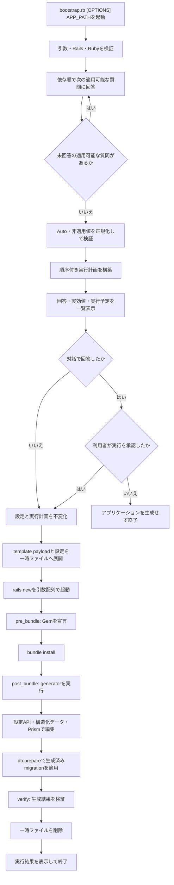

# テンプレート処理フロー

Rapid Rails Templateは、単一の`bootstrap.rb`で前段の対話とApplication Templateの適用を連携します。すべての回答と実行内容を確定してから`rails new`を起動するため、Rails標準ファイルの生成前に`--skip-*`を含むgenerator optionを確定できます。

## 変更開始境界

引数・環境検証、質問、回答の正規化、実行計画の構築と表示は、アプリケーションも一時ファイルも生成しないフェーズです。最終確認で中止した場合、`rails new`、`gem`、generator、Railsコマンド、ファイル編集は実行しません。

Application Templateだけでは、確認時点ですでにRails標準のアプリケーションファイルが存在します。本プロジェクトはその制約を後処理で補わず、`bootstrap.rb`へ対話と確認を置きます。

## フェーズ

### 環境検証

Railsが`>= 8.1, < 8.2`、Rubyが`>= 4.0, < 4.1`であることを確認します。対象外の場合は質問や変更を開始せず終了します。

### 質問と計画

CLI引数で指定された個別設定を事前回答とし、依存順に未指定の適用可能な質問だけを行います。すべての適用可能な項目がCLI引数で確定している場合は、対話と最終承認を省略します。回答は後続質問の表示条件にだけ使用し、質問中にGem追加、generator、file action、外部commandを実行しません。依存条件を満たさない質問は、仕様で定めた明示値へ正規化します。

全質問が完了してから、回答の検証、`Auto`値の解決、generator optionとstepの構築を行います。確認画面には質問時の回答だけでなく、正規化後の実効値、解決理由、Gem、generator option、step、生成物、production processを一覧で提示します。

利用者が承認した時点で設定と実行計画を不変化します。承認後に質問を追加したり、回答を再解釈したり、実行計画を暗黙に変更したりしません。

### Railsアプリケーション生成

固定構成と回答からgenerator optionを構築します。Application Template payloadと正規化済み設定を権限制限された一時ファイルへ展開し、設定パスを`RAPID_RAILS_TEMPLATE_CONFIG`環境変数、template pathを`--template`として`rails new`を起動します。SQLite、Importmap、Tailwind CSSなどの初期構成と、メール、Action Text、RuboCop、Solid系機能、デプロイ方法のskip optionはこの時点で確定済みです。

`rails new`はshell文字列として実行せず、実行ファイルと各optionを分離した引数配列で起動します。Application Templateは回答を再質問しません。

### `pre_bundle`

Rails Application Templateの`gem`などを利用して、bundle installに必要な依存関係を宣言します。このフェーズより前にGemfileを変更しません。

### `post_bundle`

認証とSolid系generatorがすべてのmigrationを生成し、database構成が確定した後に`bin/rails db:prepare`を実行します。生成直後のdevelopmentとtestにpending migrationを残しません。

依存関係のインストール後、gemが提供するgenerator、Railsのgenerator、`rails_command`、設定APIを実行します。daisyUIはこのフェーズでnpm packageとして導入し、Tailwind CSS 4のinput stylesheetへcustom themeを登録します。認証方式に応じたViewを展開した後、daisyUIのcomponent、part、modifierを優先してapplication・authentication・account layoutと標準ページを生成し、Tailwind CSSをbuildします。Tailwind CSS utilityはresponsive layoutとDESIGN固有の調整に限定し、component itemの高さやpaddingを個別utilityで上書きしません。構造化APIで表現できないRubyコード編集にはPrismを使用します。

### `verify`

generatorの成果物、必要な設定、コマンドの終了状態を検証します。検証失敗を成功として扱うフォールバックは設けず、失敗した処理と理由を表示します。

### 後始末

子プロセスの成否や割り込みにかかわらず、Application Template payloadと設定の一時ファイルを削除します。生成済みアプリケーションは、途中失敗を隠すために自動削除せず、失敗したstepと状態を利用者へ報告します。
