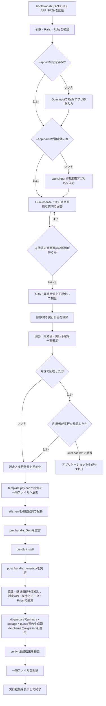

# テンプレート処理フロー

Rapid Rails Templateは、単一の`bootstrap.rb`で前段の対話とApplication Templateの適用を連携します。すべての回答と実行内容を確定してから`rails new`を起動するため、Rails標準ファイルの生成前に`--skip-*`を含むgenerator optionを確定できます。

## 変更開始境界

引数・環境検証、質問、回答の正規化、実行計画の構築と表示は、アプリケーションも一時ファイルも生成しないフェーズです。最終確認で中止した場合、`rails new`、`gem`、generator、Railsコマンド、ファイル編集は実行しません。

Application Templateだけでは、確認時点ですでにRails標準のアプリケーションファイルが存在します。本プロジェクトはその制約を後処理で補わず、`bootstrap.rb`へ対話と確認を置きます。

## フェーズ

### 環境検証

Railsが`>= 8.1, < 8.2`、Rubyが`>= 4.0, < 4.1`であることを確認します。対象外の場合は質問や変更を開始せず終了します。

### 質問と計画

`--app-id`が未指定の場合は、`APP_PATH`のbasenameを初期値として`Gum.input`でRailsアプリIDを質問します。続いて`--app-name`が未指定の場合は、確定済みのRailsアプリIDを初期値として表示用アプリ名を質問します。CLI引数で指定された個別設定を事前回答とし、依存順に未指定の適用可能な質問だけを`Gum.choose`で行います。単一選択では仕様上の既定値、`profile_features`では全featureを選択済みとして表示し、`no_limit: true`の複数選択を使用します。選択なしと`--profile-features=`はProfile生成を無効にする明示回答です。RailsアプリID、表示用アプリ名を含むすべての適用可能な項目がCLI引数で確定している場合は、対話と最終承認を省略します。回答は後続質問の表示条件にだけ使用し、質問中はGum実行可能ファイル以外の外部command、Gem追加、generator、file actionを実行しません。依存条件を満たさない質問は、仕様で定めた明示値へ正規化します。

全質問が完了してから、回答の検証、`Auto`値の解決、generator optionとstepの構築を行います。Job OperationsとMaintenance TasksはWeb PushによってSolid Queueが必須になった場合、またはSolid Queueが選択済みの場合だけ質問し、それ以外では`disable`へ正規化します。明示`enable`とSolid Queueなしの矛盾はこの段階で拒否します。画像配信方式は常に質問し、既定のRails representation routeまたは外部imgproxy serviceを実行前に確定します。確認画面には質問時の回答だけでなく、正規化後の実効値、解決理由、Gem、generator option、step、生成物、production process、production要件を一覧で提示します。

利用者が`Gum.confirm`で承認した時点で設定と実行計画を不変化します。確認の既定値は拒否とします。承認後に質問を追加したり、回答を再解釈したり、実行計画を暗黙に変更したりしません。

### Railsアプリケーション生成

RailsアプリID、表示用アプリ名、固定構成、回答からgenerator optionとApplication Identityを構築します。Application Template payloadと正規化済み設定を権限制限された一時ファイルへ展開し、設定パスを`RAPID_RAILS_TEMPLATE_CONFIG`環境変数、RailsアプリIDをRails標準の`--name`、template pathを`--template`として`rails new`を起動します。表示用アプリ名はRails generatorへ渡さず、Application Templateが生成アプリのidentity設定へ保存します。SQLite、Importmap、Tailwind CSSなどの初期構成と、メール、RuboCop、Solid系機能、デプロイ方法のskip optionはこの時点で確定済みです。Action Textは固定構成のためskip optionを持ちません。

`rails new`はshell文字列として実行せず、実行ファイルと各optionを分離した引数配列で起動します。Application Templateは回答を再質問しません。

### `pre_bundle`

Rails Application Templateの`gem`などを利用して、bundle installに必要な依存関係を宣言します。このフェーズより前にGemfileを変更しません。Action Textのeditorとして`lexxy ~> 0.9.21`を固定で宣言します。Sorbetは全構成で常設し、`sorbet-runtime`をapplication Gem、`sorbet`をdevelopment Gem、`tapioca`をdevelopment/test Gemとして宣言します。

`screen_name`または`display_name`が選択されている場合は`haikunator`を宣言し、Profile modelのUser作成時の既定値生成に使用します。どちらも選択されていない場合はGemfileへ追加しません。`avatar`が選択されている場合だけ`boring_avatars ~> 0.1.0`をRails binding付きで宣言し、画像未設定時のSVG生成に使用します。`image_delivery=imgproxy`の場合だけ`imgproxy-rails ~> 0.3.0`を宣言し、Rails配信では追加しません。Rails標準Gemfileの`image_processing`を両方式で利用します。post-bundleではimgproxy選択時だけ、Railsが生成した`Procfile.dev`の一意なwebとCSS watch processへ開発専用署名設定を付与し、webをport 3000へ固定します。同じ設定で`bin/imgproxy-dev`を起動するimgproxy processも追加します。

### `post_bundle`

最初にAction Textの公式install generatorを実行し、Active StorageとAction Textのmigrationを常設します。直後に`active_storage_db`の公式migration taskを実行し、生成されたファイル本体用migrationを`db/storage_migrate`へ移します。続けてLexxyとActive StorageをImportmapへ登録します。Deviseの公式generatorは全構成で実行し、migrationとUser modelを`login_id`＋password契約へ構造的に補正します。SIWE選択時だけ`:siweable`、credential、database challenge、route、管理画面を追加します。

認証生成より前にApplication Identity、ja/en locale、request locale境界、canonical originを設定します。認証Userを生成した直後にAction Policy、`UserRole`、policy、管理画面、`users.id`を受け取るadmin付与taskを生成し、全機能をDeviseの`current_user`へ接続します。固定ページ、FAQ、footer設定、Profile、API、PWA、Web Push、Solid系機能は追加ログイン方法を参照しません。Maintenance Tasks metadataには`triggered_by_user_id`を保存します。

databaseとannotationを確定してからTapiocaを初期化し、test databaseを準備してtest環境のRails DSL RBIを全体生成します。その後、model、policy、service、job、mailer、validator、application-owned `lib`の先頭へ`# typed: true`を付与し、`sorbet/rbi/shims/framework_bindings.rbi`を生成してからSorbet検証へ進みます。DSL／Gem／annotation RBIは生成物として手動編集せず、アプリ定義methodはRuby本体のinline signature、限定的なframework wiringだけはshimで表現します。

依存関係のインストール後、公式generatorと設定APIを実行します。daisyUIをTailwind CSS 4へ登録し、Rails標準を基準とするscaffoldとcontroller View templateを配置します。Deviseのsessions・registrations Viewを常設し、SIWE選択時だけlogin導線と、アカウント設定内のEVMウォレットログインCRUD画面を追加します。ウォレットの名称変更はedit、パスワード確認を伴う解除はshowへ分離します。tabpanelを伴うタブは共通`with_tab` helperで生成し、account settingsとMission Control Jobsで同じDOM契約を使用します。各画面は主見出しを`content_for :page_title`へ1回だけ設定し、accountとadminは共通`with_menu` layoutを使用します。Tailwind CSS utilityはresponsive layoutとDESIGN固有の調整に限定し、構造化APIで表現できないRubyコード編集にはPrismを使用します。

### `verify`

generatorの成果物、必要な設定、コマンドの終了状態を検証します。生成アプリケーションの通常テストには`bin/annotaterb models --frozen`に加え、Gem RBIとtest環境のRails DSL RBIの鮮度、shim重複、`bundle exec srb tc`を検査するtestを含めます。`dsl --verify`はRails DSL生成物だけ、`check-shims`は生成RBIとの重複、`srb tc`はinline signatureとRuby本体を含む全体整合性を担当します。既存の`bin/rails test`、`bin/ci`、GitHub Actionsは同じtestを実行します。検証失敗を成功として扱うフォールバックは設けず、失敗した処理、理由、更新commandを表示します。

通常のアプリ生成ではブラウザを起動しませんが、test用の`evidence:capture` Rake taskと撮影runnerを生成します。`rake evidence:update`はSIWE、PWA、Web Push、Solid Queue、管理者向け運用画面、全Profile機能、imgproxy、API、Solid Cable、mail、Dokployを有効にした日本語sampleを1回だけ生成します。同じアプリで全Rails test、Sorbet・RBI検証、RuboCopを実行し、password基底の共通画面、SIWE、画像配信の全シナリオを撮影して整合性検証が成功した場合だけ`docs/evidence/`を置換します。

### 後始末

子プロセスの成否や割り込みにかかわらず、Application Template payloadと設定の一時ファイルを削除します。生成済みアプリケーションは、途中失敗を隠すために自動削除せず、失敗したstepと状態を利用者へ報告します。
